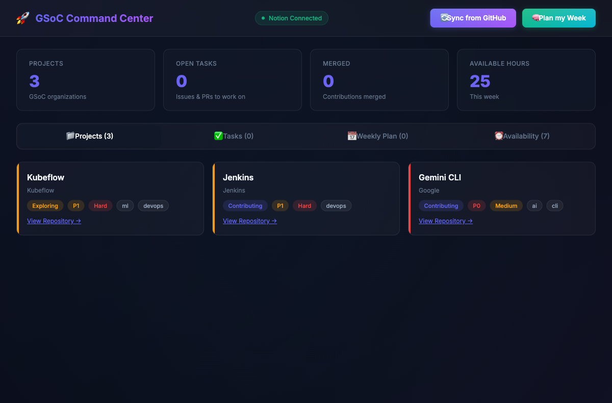

# AutoPM — AI Product Manager

> AI-powered product management assistant that creates PRDs, task breakdowns, standups, and sprint plans directly in Notion — built with **HuggingFace Inference API** + **Notion MCP**.

Built for the [dev.to Notion MCP Challenge](https://dev.to/challenges/notion-2026-03-04).

**Live demo:** [autopm-two.vercel.app](https://autopm-two.vercel.app)



## What It Does

Enter a product idea and AutoPM:
1. **Generates a full PRD** via HuggingFace AI (problem, goals, personas, user stories, scope)
2. **Creates an Epics & Tasks breakdown** with priorities and story points
3. **Writes everything to Notion** via Notion MCP (stdio transport)
4. **Reads your workspace** via MCP to generate context-aware standups and sprint plans

## How I Used Notion MCP

AutoPM uses `@notionhq/notion-mcp-server` via **stdio transport** for ALL Notion operations:

- **Reads** — `API-post-search` to scan workspace pages, `API-get-block-children` to read task data
- **Writes** — `API-post-page` to create PRD pages, task breakdowns, standup reports, sprint plans
- **Auth check** — `API-get-self` to verify MCP connectivity on health check

The MCP server is spun up per-request via `npx -y @notionhq/notion-mcp-server` as a stdio child process, managed by the Python `mcp` SDK's `ClientSession`.

```python
from mcp import ClientSession, StdioServerParameters
from mcp.client.stdio import stdio_client

async with stdio_client(StdioServerParameters(
    command="npx",
    args=["-y", "@notionhq/notion-mcp-server"],
    env={"NOTION_TOKEN": token},
)) as (read, write):
    async with ClientSession(read, write) as session:
        await session.initialize()
        await session.call_tool("API-post-page", {...})
```

## Architecture

```
┌─────────────────┐     ┌──────────────────────┐     ┌──────────────────────┐
│  Browser (UI)   │────▶│  FastAPI Backend      │────▶│  Notion MCP Server   │
│  Vanilla HTML   │     │  (Python)             │     │  (stdio transport)   │
└─────────────────┘     └────────┬─────────────┘     │  npx @notionhq/      │
                                 │                    │  notion-mcp-server   │
                                 ▼                    └──────────┬───────────┘
                        ┌──────────────────┐                    │
                        │  HuggingFace     │                    ▼
                        │  Inference API   │           ┌─────────────────┐
                        │  (Qwen 72B)      │           │  Notion API     │
                        └──────────────────┘           └─────────────────┘
```

**Flow:** HuggingFace generates structured content → Backend formats Notion blocks → MCP server writes to Notion

## Features

### PRD Generator
- Full PRD with Problem Statement, Goals, User Personas, User Stories, Out of Scope
- Epics & Tasks breakdown with Priority, Story Points
- Sprint 1 plan with ~20 story points selected

### Daily Standup
- **Reads** existing workspace pages via MCP for context
- Generates standup with completed/in-progress/blockers
- **Writes** standup page to Notion via MCP

### Sprint Planner
- **Reads** task pages from Notion via MCP
- Plans next sprint from backlog (~20 story points)
- **Writes** sprint plan to Notion via MCP

## Quick Start

### Prerequisites
- Python 3.11+
- Node.js 18+ (for `npx @notionhq/notion-mcp-server`)
- [Notion Integration](https://www.notion.so/my-integrations) with API key
- [HuggingFace API Token](https://huggingface.co/settings/tokens) (free tier works)

### Setup

```bash
git clone https://github.com/himanshu748/dev-challenge-1.git
cd dev-challenge-1
python3 -m venv venv && source venv/bin/activate
pip install -r requirements.txt

cp .env.example .env
# Edit .env with your keys

uvicorn main:app --reload
```

Open [http://localhost:8000](http://localhost:8000).

## Environment Variables

| Variable | Required | Description |
|----------|----------|-------------|
| `HF_API_KEY` | Yes | HuggingFace API token (free tier) |
| `NOTION_TOKEN` | Yes | Notion integration token |
| `NOTION_PARENT_PAGE_ID` | Yes | Notion page ID for workspace |
| `HF_MODEL` | No | Default: `Qwen/Qwen2.5-72B-Instruct` |

## API Endpoints

| Method | Endpoint | Description |
|--------|----------|-------------|
| GET | `/` | Dashboard UI |
| GET | `/api/health` | Health check (includes MCP status) |
| POST | `/api/generate-prd` | Generate PRD + task breakdown |
| POST | `/api/standup` | Read workspace + write standup |
| POST | `/api/plan-sprint` | Read backlog + write sprint plan |

## Tech Stack

- **Frontend:** Vanilla HTML/CSS/JS — glassmorphism dark theme
- **Backend:** FastAPI (Python)
- **AI:** HuggingFace Inference API — `Qwen/Qwen2.5-72B-Instruct`
- **Notion:** MCP protocol via `@notionhq/notion-mcp-server` (stdio transport)
- **MCP SDK:** `mcp` Python package — `ClientSession` + `StdioServerParameters`

## License

MIT
